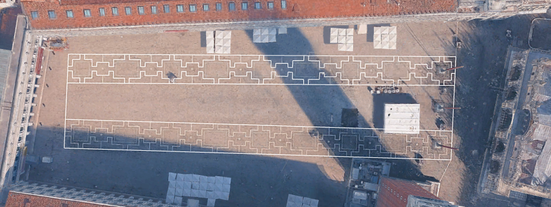
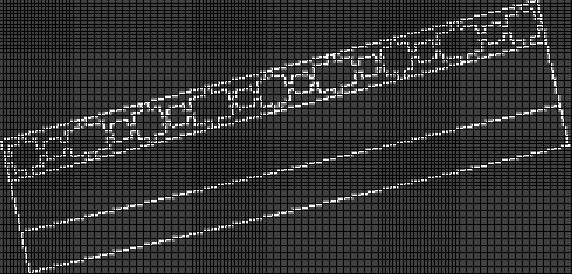
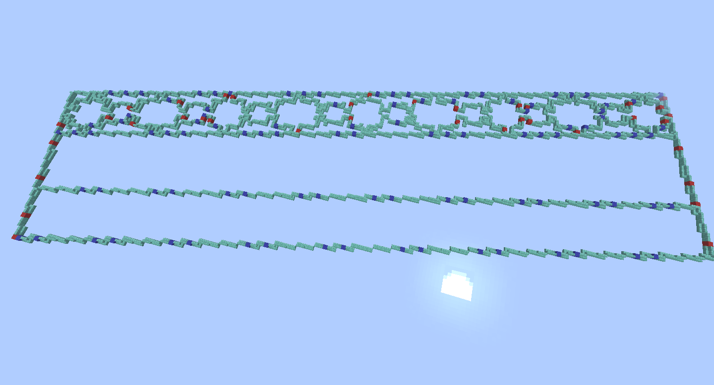
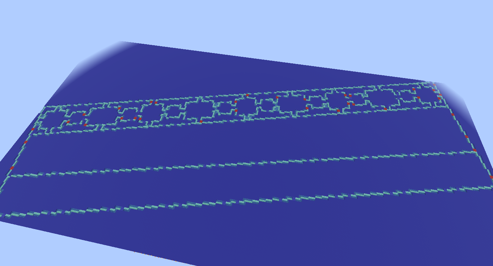

# BTEGeometryTools
## Overview
A set of geometry tools for Build The Earth (BTE) building in Minecraft. Currently one tool is available, with one tool in development:
1. The line tool takes input line-geometry files (GeoJSON, KMZ), converts the lines contained within into in-game coordinates, rasterizes the lines into half-block sections, and converts the relevant points into a block schematic. Currently, the only blocks supported are stairs, which have half-block resolution and are used for floor lines.
2. The roof tool is in development, and will convert input roof geometry (format TBD) into a block schematic.

### Example, line tool
Input lines as drawn in Google Earth Pro:

Output image showing the shape/geometry of the output block schematic:

The output block schematic, in-game:

The output block schematic, in-game with background blocks and waterlogging, as expected in-situ:

## How do I use it?
Right now, the only way to use the tool is to get the repo locally and to run `BTEGeometryTools` directly. A few Python packages are required to run this:

1. `numpy` is used for general math processing needs. Visit [Numpy's installation page](https://numpy.org/install/) for more info.
2. `fastkml` is used for parsing input KMZ/KML files. Visit [fastkml's installation page](https://fastkml.readthedocs.io/en/latest/index.html#installation) for more info.
3. `terrapyconvert` is used for converting real-world coordinates to Minecraft coordinates through the projection used by Build the Earth. Visit [terrapyconvert's PyPI page](https://pypi.org/project/terrapyconvert/) for more info.
4. `mcschematic` is used for producing Minecraft schematics of results. Visit [mcschematic's PyPI page](https://pypi.org/project/mcschematic/) for more info.
5. `pillow` is used for producing images of results. Visit [Pillow's installation page](https://pillow.readthedocs.io/en/stable/installation/basic-installation.html) for more info.
6. `tqdm` is used for the progress bar. Visit [tqdm's PyPI page](https://pypi.org/project/tqdm/) for more info.

Your best bet is just going to be use `pip`.

The program is run like so:
`python BTEGeometryTools [tool] [-i <INPUT>] [-o <OUTPUT>] [-v]`
Where:
1. `[tool]` is **REQUIRED**, and is either 'line' (for the line tool), or 'roof' (for the roof tool, not yet available.)
2. `[-i <INPUT>]` is optional, and is the input file to be converted (for the line tool, this can only be a GeoJSON or KMZ file); if none is specified, coordinate/geometry information must be manually input.
3. `[-o <OUTPUT>]` is the output filename; if none is specified, "output" is used by default.
4. `-v` is the verbose flag; if selected, for the line tool this simply prints out the converted in-game coordinates of the input lines.